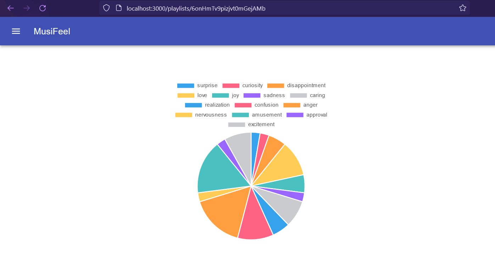

# MusiFeel

A visualizer for the emotions of music built on NextJS, Django, and Tensorflow.

<figure>
    
    <figcaption>
        Early Stage Visualization
    </figcaption>
</figure>

## Overview

MusiFeel is a data visualization tool that leverages AI to classify the lyrics of music playlists into a range of different emotions. By entering a link to a playlist, users can access a chart of the emotions. MusiFeel aims to provide users with yet another way to find new music, matching up their moods with others'.

## Solution Design

MusiFeel leverages Spotify API and Genius API to scrape lyrics from user playlists for use in emotional sentiment analysis. These lyrics are parsed and sent to a Tensorflow language model to be classified into 1 of 28 different emotions. These emotions can be grouped by song, playlist, and user to be stored and retrieved in the future. Users can then query MusiFeel to view a visualization of these emotions.

## Local Use

